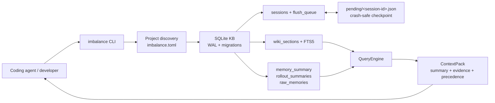

# imbalance

[](https://github.com/Gosayram/imbalance)
[](https://www.python.org/)
[](LICENSE)

> SQLite-first local knowledge base and lightweight context layer for coding agents.

`imbalance` keeps useful project context close to the repository: decisions, current work,
issues, memory summaries, and retrieval evidence are stored locally in SQLite and returned
as small, structured context packs.

> [!IMPORTANT]
> `imbalance` is at **v0.1.0**. The local SQLite foundation, FTS5 retrieval, context-pack
> model, configuration discovery, durable session checkpoints, retry queue primitives,
> circuit-breaker state machine, CLI scaffold, and development environment are implemented.
> MCP integration, daemon lifecycle, provider-backed queue processing, embeddings, and Web
> UI are planned work.

## Why imbalance

Long coding sessions accumulate decisions, constraints, and debugging discoveries that are
easy to lose between sessions or after compaction. `imbalance` is designed around a narrow,
local-first workflow:

- Persist high-signal project knowledge in one SQLite database.
- Retrieve only the context relevant to the current task and token budget.
- Keep memory advisory: current instructions and the working tree take precedence.
- Remain usable offline for storage and FTS5 search.
- Add heavier capabilities, such as embeddings or LLM consolidation, only as optional layers.

## Current Capabilities

| Area                  | Available in `0.1.0`                                                                        |
| --------------------- | ------------------------------------------------------------------------------------------- |
| Project configuration | Upward discovery of `imbalance.toml` with local KB resolution                               |
| Storage               | SQLite WAL database, migrations, passive autocheckpoint, integrity check, FTS5 index        |
| Knowledge records     | Wiki sections, history, tags, links, sessions, idempotent flush queue                       |
| Reliability           | Atomic pending checkpoint files, startup recovery primitive, retry backoff, circuit breaker |
| Context engineering   | `ContextPack`, memory-summary schema, rollout/raw memory schema, tool-result receipts       |
| CLI                   | `project`, `init-db`, `doctor`, `save-fact`, `search`, `session`, and `queue` commands      |
| Development           | `uv` lockfile, Python 3.12 `.venv`, Ruff, mypy, pytest, dev container, git-cliff            |

## Architecture



Context precedence is explicit:

```text
current_task > current_filesystem > session_notes > memory_summary > wiki_sections > archived
```

## Quick Start

### Requirements

- Python `3.12`
- [`uv`](https://docs.astral.sh/uv/)
- `make` for convenience commands

### Local Development

```bash
git clone git@github.com:Gosayram/imbalance.git
cd imbalance

make sync
make init-db
make doctor
```

`uv` creates a local `.venv` and synchronizes it from `pyproject.toml` and `uv.lock`.
Local KB data is written to `.data/imbalance` by the Makefile commands.

### Try the CLI

```bash
# Inspect the active project configuration.
IMBALANCE_DATA_DIR=.data/imbalance uv run imbalance project info

# Store a project decision.
IMBALANCE_DATA_DIR=.data/imbalance uv run imbalance save-fact \
  "Use SQLite WAL for reliable local writes." \
  --section decisions \
  --slug decisions/sqlite-wal \
  --tag sqlite \
  --tag reliability

# Retrieve a structured context pack.
IMBALANCE_DATA_DIR=.data/imbalance uv run imbalance search "SQLite WAL"

# Create a session and persist a flush checkpoint for later provider processing.
SESSION_ID="$(IMBALANCE_DATA_DIR=.data/imbalance uv run imbalance session start)"
IMBALANCE_DATA_DIR=.data/imbalance uv run imbalance session checkpoint "$SESSION_ID" \
  --summary "Implemented SQLite reliability primitives." \
  --decision "Persist pending flush payloads atomically." \
  --next-step "Process the queue through ModelRouter."

# Inspect durable queued work.
IMBALANCE_DATA_DIR=.data/imbalance uv run imbalance queue status
```

Example output:

```xml
<context-pack>
<precedence>current_task > current_filesystem > session_notes > memory_summary > wiki_sections > archived</precedence>
<evidence slug="decisions/sqlite-wal" section="decisions" confidence="0.10">
Use SQLite WAL for reliable local writes.
</evidence>
</context-pack>
```

## Project Configuration

Each repository owns an `imbalance.toml` file:

```toml
[project]
name = "imbalance"
version = "1"

[kb]
store = "imbalance"

[retrieval]
budget_tokens = 2000

[memory]
mode = "read_write"
live_update = true
max_summary_tokens = 500
max_raw_memories_for_consolidation = 128

[security]
redact_secrets = true
redact_pii = true
log_prompt_bodies = false
```

`imbalance` walks upward from the current working directory to find this file, so commands
can be run from nested folders inside the project.

## Commands

| Command                                          | Purpose                                                            |
| ------------------------------------------------ | ------------------------------------------------------------------ |
| `imbalance project init`                         | Create `imbalance.toml` in the current repository                  |
| `imbalance project info`                         | Show the resolved project and KB location                          |
| `imbalance init-db`                              | Create/migrate the SQLite knowledge base                           |
| `imbalance doctor`                               | Run database initialization and `integrity_check`                  |
| `imbalance save-fact TEXT --section SECTION`     | Store a knowledge record with optional tags and slug               |
| `imbalance search QUERY`                         | Return a budgeted `ContextPack` from FTS5 retrieval                |
| `imbalance session start`                        | Start a durable session and print its UUID                         |
| `imbalance session checkpoint ID --summary TEXT` | Atomically persist a pending flush payload and enqueue it          |
| `imbalance session list`                         | Display session state and pending checkpoint location              |
| `imbalance queue status`                         | Display all queued flush payloads and retry metadata               |
| `imbalance queue recover`                        | Re-enqueue recoverable `pending_flush` sessions after interruption |

## Development Environment

### Dev Container

The repository includes a reproducible [`.devcontainer`](.devcontainer) environment with:

| Tool        | Version / Policy                  |
| ----------- | --------------------------------- |
| Python      | `3.12`                            |
| `uv`        | Installed from Astral's installer |
| SQLite CLI  | `3.46+`                           |
| `git-cliff` | `2.13.1` binary                   |

Opening the repository in the dev container automatically runs:

```bash
UV_CACHE_DIR=.uv-cache uv sync --extra dev
```

The dev container uses Prettier on save for Markdown, JSON, and YAML through
`.prettierrc.json`. Python, SQL, and TOML remain outside Prettier ownership; Python formatting
is handled by Ruff.

### Quality Checks

```bash
make test
make lint
make typecheck
make changelog-check
```

| Target                 | Checks                                               |
| ---------------------- | ---------------------------------------------------- |
| `make test`            | Unit and SQLite integration tests                    |
| `make lint`            | Ruff linting configured in `pyproject.toml`          |
| `make format`          | Ruff formatter followed by safe autofixes            |
| `make typecheck`       | mypy over `src/`                                     |
| `make doctor`          | Local SQLite initialization and integrity validation |
| `make changelog-check` | Changelog rendering through `git-cliff`              |

## Storage Model

The initial migrations create a compact schema:

| Table / Index                                         | Purpose                                                |
| ----------------------------------------------------- | ------------------------------------------------------ |
| `wiki_sections` + `wiki_fts`                          | Durable knowledge and local full-text retrieval        |
| `wiki_history`, `wiki_tags`, `kb_links`               | Audit trail and lightweight knowledge relationships    |
| `sessions`, `flush_queue`                             | Durable session state and idempotent retry scheduling  |
| `memory_summary`, `raw_memories`, `rollout_summaries` | Progressive context-memory layers                      |
| `tool_result_receipts`                                | Compact references for large, re-fetchable tool output |

## Roadmap

- [x] Package scaffold, Python 3.12/`uv` development workflow, dev container
- [x] SQLite WAL storage, migrations, FTS5 retrieval, history/tags/link schema
- [x] Context-pack representation and basic CLI workflow
- [x] Session lifecycle, atomic pending checkpoints, durable queue, retry backoff
- [x] Circuit-breaker state machine for future provider adapters
- [ ] MCP tools/resources for coding agents
- [ ] Daemon recovery loop, provider router wiring, and consolidation pipeline
- [ ] Optional `sqlite-vec` hybrid retrieval and embeddings
- [ ] Optional Web UI and operational metrics

## Design Principles

- **SQLite-first:** one portable local store for knowledge, history, and retrieval.
- **Progressive disclosure:** small summaries first, evidence only when task-relevant.
- **Offline-capable core:** local storage and lexical retrieval work without providers.
- **Advisory memory:** repository state and current task override stored context.
- **Optional intelligence:** embeddings and model-backed consolidation never burden the core.

## License

Licensed under the [GNU General Public License v3.0 only](LICENSE).
